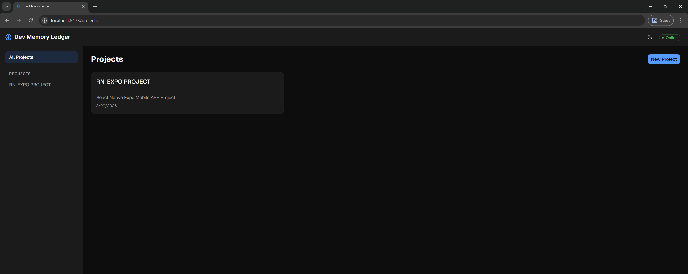
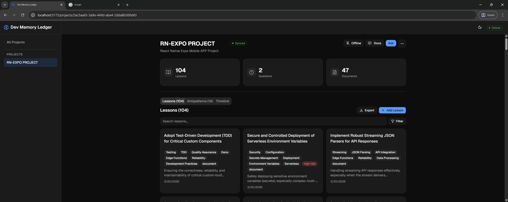
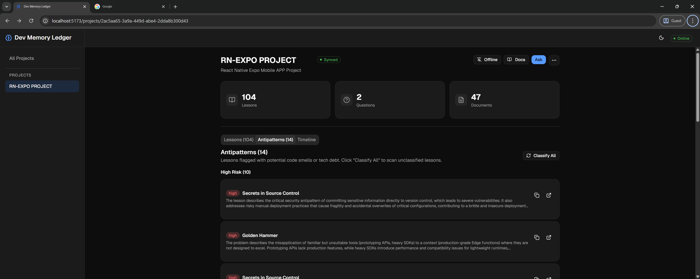
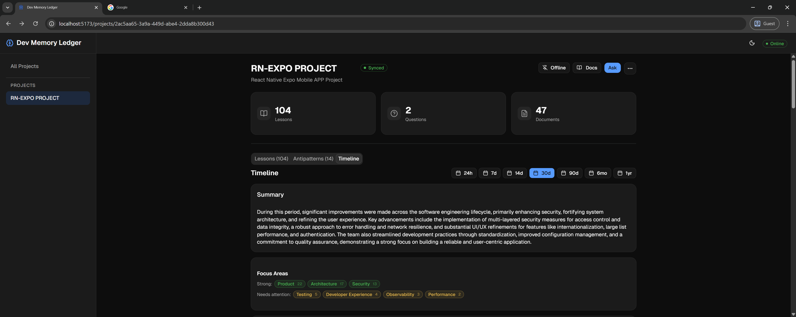
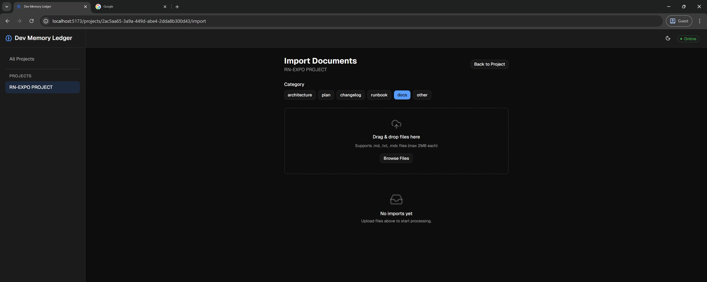
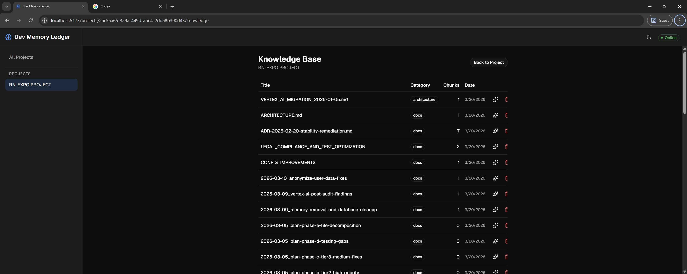
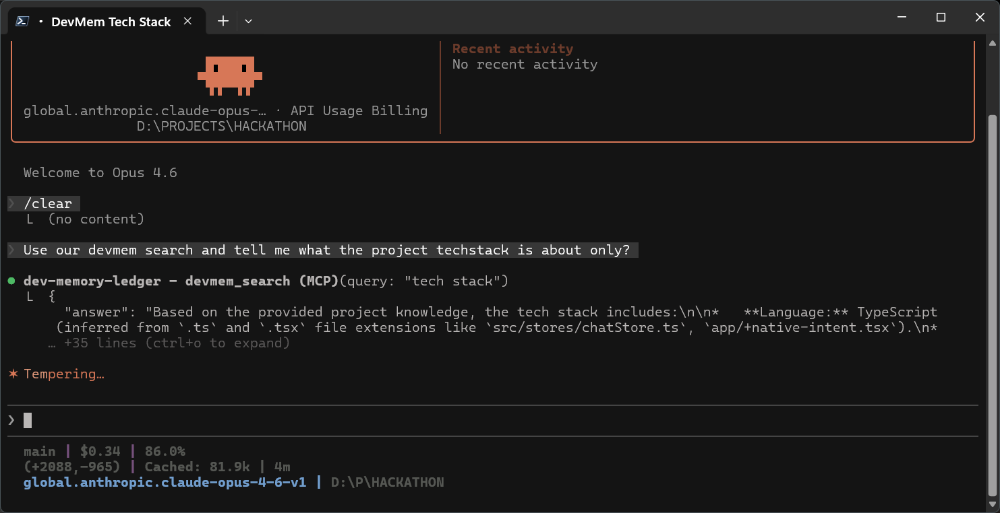
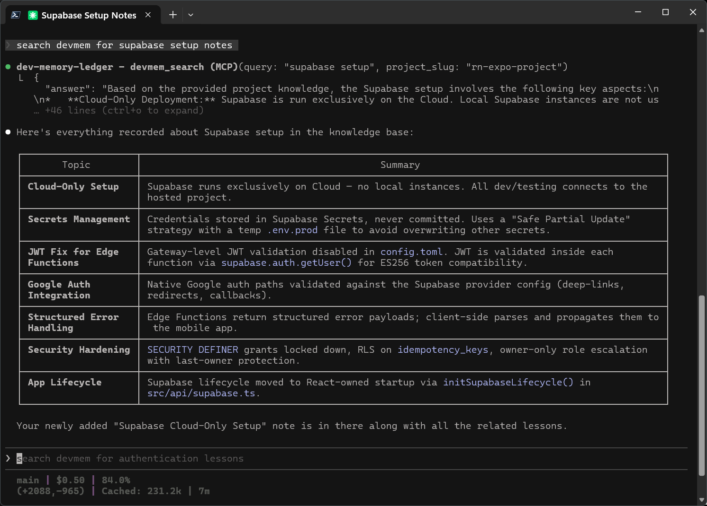

<div align="center">


# DevMem AI

**Local-first AI memory for your codebases** — captures lessons from docs and commits,
recalls them in your IDE, and tracks project health over time.

[](https://www.powersync.com)
[](https://supabase.com)
[](https://modelcontextprotocol.io)
[](https://www.typescriptlang.org)
[](LICENSE)

[Features](#features) · [Architecture](#architecture) · [Why PowerSync?](#why-powersync) · [MCP Tools](#mcp--ide-integration) · [Get Started](#getting-started)

</div>

---

<!-- TODO: Replace with demo video thumbnail once recorded
<div align="center">
  <a href="https://youtube.com/watch?v=XXXXX">
    
  </a>
  <p><em>Watch the 2-minute demo</em></p>
</div>

---
-->

## Screenshots

<div align="center">
  
  <p><em>Projects dashboard — create and manage project knowledge bases</em></p>
</div>

<div align="center">
  
  
</div>
<p align="center"><em>Left: Lesson cards with tags and risk badges. Right: Antipattern radar with severity levels.</em></p>

<div align="center">
  
  
</div>
<p align="center"><em>Left: AI-generated timeline summary with focus areas. Right: Document import with category tagging.</em></p>

<div align="center">
  
  
</div>
<p align="center"><em>Left: Knowledge base with ingested documents. Right: MCP tool call from Claude Code.</em></p>

<div align="center">
  
  <p><em>Claude Code retrieves structured knowledge from the ledger via MCP</em></p>
</div>

---

## The Problem

Knowledge is scattered across commits, docs, Slack threads, and post-mortems — impossible to search when you need it. The same bugs keep resurfacing because fixes aren't captured in a structured, searchable form. Architectural decisions live in someone's head and vanish when they change teams.

## The Solution

DevMem AI captures development knowledge from documents and code changes, structures it into searchable lessons using Gemini AI, and makes it available everywhere — in the browser (offline-first via PowerSync), in your IDE (via MCP tools), and through a CLI. It doesn't just store knowledge; it actively surfaces antipatterns, tracks improvement trends, and answers questions grounded in your project's history.

---

## Features

- **RAG-Powered Q&A** — Ask questions in natural language and get answers grounded in your project's knowledge base, with cited sources.
- **Error Assistant** — Paste a stack trace and see matching past incidents, root causes, and fixes.
- **Antipattern Radar** — Every lesson is auto-classified for risk level. Browse flagged patterns and get AI refactor suggestions.
- **Timeline & Focus Areas** — Summarize improvements over 24h to 1yr. See which areas (Testing, Security, Performance...) are strong or need attention.
- **Doc Ingestion Pipeline** — Upload docs, watch real-time chunking progress, and auto-extract structured lessons with Gemini AI.
- **Offline Briefcase** — Pin projects for offline use. PowerSync keeps a local SQLite copy that syncs when reconnected.
- **MCP Server** — 7 tools accessible from Claude Code, Cursor, or any MCP-compatible agent. Search, save lessons, summarize — all from your IDE.

---

## Architecture

```
Browser (React 19 + shadcn/ui)
  |  SQL queries + reactive hooks
  v
PowerSync SDK (local SQLite via wa-sqlite)
  |  Sync Streams (edition 3, auto_subscribe)
  v
PowerSync Service
  |  Logical replication
  v
Supabase Postgres + pgvector (384-dim HNSW)
  |
  v
Edge Functions (12 endpoints)              MCP Server (7 tools, stdio)
  search · create-lesson · save-note          |
  summarize · generate-lessons · ingest     Claude Code / Cursor / Windsurf
  classify · embed · delete-doc
  list-docs · dev-token
```

- **Frontend** — React 19 with shadcn/ui. All reads and writes go through PowerSync's local SQLite first, then sync to Postgres.
- **PowerSync** — Bidirectional sync via Sync Streams. Four tables (projects, lessons, questions, ingest_jobs) stay available offline.
- **Supabase** — Postgres with pgvector for 384-dim embeddings (HNSW cosine index), Storage for document uploads, Edge Functions for all AI and data operations.
- **AI** — Gemini 2.5 Flash for lesson extraction, summarization, antipattern classification, and RAG answers. Supabase.ai `gte-small` for embeddings.
- **MCP Server** — 7 tools over stdio JSON-RPC. Workspace-agnostic with auto-resolving project slugs via `.devmemory.json`.

---

## Tech Stack

| Layer | Technology |
|-------|-----------|
| Frontend | React 19, Vite 8, TypeScript 5.9, Tailwind CSS v4, shadcn/ui |
| Local-first sync | PowerSync Web SDK, wa-sqlite, Sync Streams (edition 3) |
| Backend | Supabase Postgres, pgvector (384-dim HNSW), Edge Functions (Deno) |
| AI | Google Gemini 2.5 Flash (generation + classification), Supabase.ai `gte-small` (embeddings) |
| Agent integration | MCP server (stdio transport) |
| Storage | Supabase Storage (`doc-uploads` bucket) |

---

## Why PowerSync?

PowerSync isn't a sync layer bolted on — it's the **architectural foundation** of DevMem AI.

- **Zero-latency reads** — Every query runs against local SQLite via PowerSync. Browsing lessons, searching, filtering — all sub-millisecond, regardless of network conditions.
- **True offline operation** — Pin a project and disconnect. Browse lessons, review antipatterns, check Q&A history — everything works. Reconnect and changes sync automatically.
- **Sync Streams (edition 3)** — Four tables (`projects`, `lessons`, `questions`, `ingest_jobs`) stream from Supabase Postgres to the browser via `auto_subscribe: true` streams.
- **Bidirectional writes** — New projects and lessons are written to local SQLite first, then synced to Postgres via PowerSync's `uploadData` connector.
- **Real-time ingestion progress** — Document processing progress updates are written to the `ingest_jobs` table in Postgres and stream to the client reactively via PowerSync — no polling needed.
- **What breaks without it** — Without PowerSync, every read hits the network (200-500ms latency), the app dies offline, and real-time ingestion progress requires polling instead of reactive local queries.

> PowerSync schema: [`src/powersync/schema.ts`](src/powersync/schema.ts) · Connector: [`src/powersync/connector.ts`](src/powersync/connector.ts)

### Offline Demo

1. Open a project and click the **Offline** pin button
2. Disconnect your network (DevTools → Network → Offline)
3. Browse lessons, view antipatterns, check timeline — everything works
4. Reconnect — changes sync automatically

---

## MCP / IDE Integration

DevMem AI exposes 7 tools via the Model Context Protocol. Any MCP-compatible agent (Claude Code, Cursor, Windsurf) can search your knowledge base, save lessons, and summarize trends — all without leaving the terminal.

| Tool | Description |
|------|-------------|
| `devmem_list_projects` | Discover available projects and their slugs |
| `devmem_search` | RAG search — question, error, or antipattern mode |
| `devmem_save_lesson` | Save a structured lesson from a code change or bug fix |
| `devmem_save_note` | Save a note, guideline, standard, or decision |
| `devmem_summarize` | Summarize improvements over a time period |
| `devmem_attach` | Attach the current workspace to a project |
| `devmem_create_project` | Create a new project in the ledger |

<details>
<summary><strong>MCP Configuration</strong></summary>

Add to your project's `.mcp.json`:

```json
{
  "mcpServers": {
    "devmem-ai": {
      "command": "npx",
      "args": ["tsx", "/path/to/devmem-ai/mcp/server.ts"],
      "env": {
        "SUPABASE_URL": "https://your-project.supabase.co",
        "SUPABASE_ANON_KEY": "your-anon-key"
      }
    }
  }
}
```

After calling `devmem_attach` once, a `.devmemory.json` file is written to your workspace root. All subsequent calls auto-resolve the project — no slug needed.

</details>

---

## Getting Started

### Prerequisites

- [Node.js](https://nodejs.org) 18+
- [Supabase CLI](https://supabase.com/docs/guides/cli)
- [PowerSync account](https://www.powersync.com) (free tier works)

### Setup

**1. Clone and install**

```bash
git clone <repo-url> devmem-ai
cd devmem-ai
npm install
```

**2. Configure environment**

```bash
cp .env.local.example .env.local
```

| Variable | Description |
|----------|-------------|
| `VITE_SUPABASE_URL` | Your Supabase project URL |
| `VITE_SUPABASE_ANON_KEY` | Supabase anon/public key |
| `VITE_POWERSYNC_URL` | PowerSync instance URL |
| `POWERSYNC_JWT_SECRET` | Secret for signing PowerSync JWTs |

**3. Start the database**

```bash
supabase start
supabase db push
```

**4. Deploy Edge Functions**

```bash
supabase functions deploy --no-verify-jwt
```

**5. Run the app**

```bash
npm run dev
```

Open [http://localhost:5173](http://localhost:5173).

**6. (Optional) Start the MCP server**

```bash
npm run mcp:dev
```

---

## Project Structure

```
devmem-ai/
├── src/
│   ├── routes/            # Page components (React Router v7)
│   ├── components/        # UI organized by feature area
│   │   ├── lessons/       # Lesson cards, filters, detail dialog
│   │   ├── antipatterns/  # Antipattern tab, classification
│   │   ├── timeline/      # Period selector, focus areas
│   │   ├── questions/     # Ask page, Q&A history
│   │   ├── knowledge/     # Document table, import flow
│   │   └── ui/            # shadcn/ui primitives
│   ├── hooks/             # Data hooks (use-lessons, use-search, etc.)
│   ├── services/          # API service layer
│   ├── powersync/         # Schema, connector, provider
│   └── types/             # Shared TypeScript interfaces
├── supabase/
│   ├── functions/         # 12 Edge Functions + _shared/ utilities
│   └── migrations/        # 12 SQL migrations
├── mcp/                   # MCP server (7 tools, stdio transport)
└── demo/                  # CLI demo scripts (Deno)
```

---

## Challenges & What We Learned

- **Offline-first data flow** — Designing for local SQLite writes that sync to Postgres required careful schema alignment between PowerSync's client-side schema and Supabase migrations.
- **RAG quality** — Balancing chunk size, embedding dimensionality (384-dim), and prompt engineering to get useful answers from project knowledge took multiple iterations.
- **Lesson deduplication** — Re-ingesting documents or re-running lesson generation created duplicates. Solved with UNIQUE constraints and upsert-based idempotent writes across all 5 creation paths.
- **Real-time ingestion progress** — Showing live progress bars for document processing required writing progress updates to a PowerSync-synced table that streams reactively to the client.

---

## What's Next

- [ ] Multi-user authentication (replace demo user with Supabase Auth)
- [ ] Git hook integration — auto-save lessons on commit
- [ ] Team collaboration — shared project knowledge bases with role-based access
- [ ] VS Code extension — native sidebar for lesson browsing and search
- [ ] Custom embedding models — allow teams to bring their own embeddings for domain-specific search

---

## Team

Built by [@senaiverse](https://github.com/senaiverse) for the [PowerSync AI Hackathon](https://www.powersync.com/blog/powersync-ai-hackathon-8k-in-prizes).

---

## License

[MIT](LICENSE)
