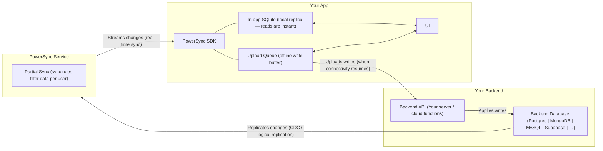

# PowerSync Skills

Use this skill to onboard a project onto PowerSync without trial-and-error. Treat this as a guided workflow first and a reference library second.

## Always Use the PowerSync CLI

**The [PowerSync CLI](https://docs.powersync.com/tools/cli.md) is the default tool for all PowerSync operations.** Do not manually create config files, do not direct users to the dashboard, and do not write service.yaml or sync-config.yaml from scratch. The CLI handles all of this.

What the CLI does — use it instead of doing these things manually:

- **Create a Cloud instance:** `powersync init cloud` → `powersync link cloud --create --project-id=<id>` (scaffolds config, creates the instance, and links it in one flow)
- **Link an existing Cloud instance:** `powersync pull instance --project-id=<id> --instance-id=<id>` (downloads config to local files)
- **Create a local self-hosted instance:** `powersync init self-hosted` → `powersync docker configure` → `powersync docker start` (spins up a full local PowerSync stack via Docker — no manual Docker setup needed)
- **Deploy config:** `powersync deploy service-config`, `powersync deploy sync-config` (validates and deploys — don't copy-paste YAML to a dashboard)
- **Generate client schema:** `powersync generate schema --output=ts` (generates TypeScript schema from deployed sync config — don't write it by hand)
- **Generate dev tokens:** `powersync generate token --subject=user-1` (for local testing — don't hardcode JWTs)

Only fall back to manual config or dashboard instructions when the user explicitly says they can't use the CLI.

Full CLI reference: `references/powersync-cli.md` — **always load this file** when setting up or modifying a PowerSync instance.

## Onboarding Playbook

When the task is to add PowerSync to an app, follow this sequence in order:

1. Identify the platform: **Cloud** or **self-hosted**.
2. Identify the backend: **Supabase** or another database.
3. If the backend is Supabase and it is unclear whether the user means **online (Supabase Cloud)** or **locally hosted** (e.g. `supabase start`), **ask the user** before choosing connection strings, auth config, or references.
4. Collect required inputs before coding.
5. Generate sync config and any required source database setup (e.g. Supabase publication SQL, Postgres publication, MongoDB replica set).
6. **Create/link the instance and deploy config before writing app code.** Use the CLI — do not create config files manually. For Cloud: `powersync init cloud` → edit config → `powersync link cloud --create` → `powersync deploy`. For self-hosted: `powersync init self-hosted` → `powersync docker configure` → `powersync docker start`. For source database setup the agent cannot run (e.g. Supabase publication SQL), present the exact SQL and ask the user to confirm it is done. The app will not sync without deployed config.
7. Only after backend readiness is confirmed, implement app-side PowerSync integration.

Do not start client-side debugging while the PowerSync service is still unconfigured. If the UI is stuck on `Syncing...`, the default diagnosis is incomplete backend setup, not a frontend bug.

## Critical Footguns

Apply these rules without exception:

- `powersync/service.yaml` uses `replication.connections`, not a top-level `connections` key.
- `powersync/sync-config.yaml` must begin with:
  ```yaml
  config:
    edition: 3
  ```
- `powersync pull instance` silently overwrites local `service.yaml` and `sync-config.yaml`.
- For existing Cloud instances, pull config before manual edits. Never pull after editing unless you have backed up the local files.
- The self-hosted Docker image listens on port **8080**, not 80. Use `-p 8080:8080` in port mapping.
- The Docker image does **not** accept a `-s` flag for sync config. Use the `POWERSYNC_SYNC_CONFIG_B64` environment variable or the `-sync64` flag.
- For local Postgres / local Supabase, set `sslmode: disable` as a YAML key on the connection — the `sslmode=disable` URI query string is ignored by pgwire.

## Default Benchmark Path

For a React web app using Supabase auth and PowerSync Cloud, load these files in this order:

1. `references/onboarding-supabase-web.md`
2. `references/supabase-auth.md`
3. `references/powersync-cli.md`
4. `references/powersync-service.md`
5. `references/sync-config.md`
6. `references/sdks/powersync-js.md`
7. `references/sdks/powersync-js-react.md`

Use the onboarding recipe as the primary workflow. Use the other references to fill in details, not to invent a different sequence.

## Required Inputs Before Coding

Collect the minimum required information for the chosen path before changing app code.

### Cloud + Supabase

- Whether the PowerSync instance already exists
- **Whether Supabase is online (hosted at supabase.com) or locally hosted** (e.g. `supabase start`) — if you cannot infer this from the project or env, **prompt the user**
- PowerSync instance URL, if an instance already exists
- Project ID and instance ID, if using CLI with an existing instance
- Supabase Postgres connection string, if PowerSync still needs the source DB connection
- Whether Supabase JWT signing uses new signing keys or legacy JWT secret, if not obvious from the setup

Only ask for secrets when you are at the step that actually needs them.

## Cloud Readiness Gate

Do not proceed to app-side code until all items below are verified:

- PowerSync instance exists
- Source database connection is configured
- Sync config is deployed
- Client auth is configured
- Instance URL is available for `fetchCredentials()`
- Source database replication/publication setup is complete

If any item is missing, finish the service setup first.

Use the CLI to verify and complete any missing items. For steps the agent cannot perform (e.g. running SQL in Supabase SQL Editor), present the exact commands and ask the user to confirm completion before writing app code.

## First Response for `Syncing...`

When the app shows `Syncing...`, check these in order before asking for browser console logs:

1. Confirm the PowerSync endpoint URL returned by `fetchCredentials()`.
2. Confirm the PowerSync service has a valid source DB connection.
3. Confirm sync config is deployed and uses `config: edition: 3`.
4. Confirm client auth is configured correctly.
5. Confirm the Supabase publication exists for the synced tables.
6. Only then inspect frontend connector or SDK state.

Before requesting console logs, ask the user to confirm:

- whether the instance exists
- whether database connection is configured
- whether sync config was deployed
- whether client auth was enabled
- whether the Supabase SQL was run

## Setup Paths

Choose the matching path after the preflight. The CLI is the default for all paths.

### Path 1: Cloud + CLI (Recommended)

Load `references/powersync-cli.md` and prefer the CLI for every step it supports:

- Create and link the instance: `powersync link cloud --create --project-id=<project-id>`
- Deploy service config: `powersync deploy service-config`
- Deploy sync config: `powersync deploy sync-config`
- Prefer `PS_ADMIN_TOKEN` in autonomous or noninteractive environments; use `powersync login` only when interactive auth is acceptable

### Path 2: Cloud + Dashboard

Only use this path if the user explicitly prefers the dashboard or the CLI is unavailable.

Guide the user through the dashboard sequence:

1. Create or open the PowerSync project and instance.
2. Connect the source database.
3. Deploy sync config.
4. Configure client auth.
5. Copy the instance URL.
6. Verify source database replication/publication setup.

If the backend is Supabase, also load `references/supabase-auth.md`.

### Path 3: Self-Hosted + CLI (Recommended)

Load `references/powersync-cli.md`, `references/powersync-service.md`, and `references/sync-config.md`. Prefer the CLI for Docker runs (`powersync docker run`, `powersync docker reset`), schema generation, and any supported self-hosted operations. See [PowerSync CLI](https://docs.powersync.com/tools/cli.md).

### Path 4: Self-Hosted + Manual Docker

Only when the CLI cannot be used. Load `references/powersync-service.md` and `references/sync-config.md`. If the backend is **not** Supabase, also load `references/custom-backend.md`.

## Architecture



Key rule: **client writes never go through PowerSync**. They go from the app's upload queue to your backend API. PowerSync handles the read and sync path only.

## What to Load for Your Task

| Task | Load these files |
|------|-----------------|
| React web app + Supabase + Cloud onboarding | `references/onboarding-supabase-web.md` + `references/supabase-auth.md` + `references/powersync-cli.md` + `references/powersync-service.md` + `references/sync-config.md` + `references/sdks/powersync-js.md` + `references/sdks/powersync-js-react.md` |
| New project setup | `references/powersync-cli.md` + `references/powersync-service.md` + `references/sync-config.md` + SDK files for your platform |
| Setting up PowerSync with Supabase | `references/onboarding-supabase-web.md` + `references/supabase-auth.md` |
| Debugging sync / connection issues | `references/powersync-debug.md` |
| Writing or migrating sync config | `references/sync-config.md` |
| Configuring the service / self-hosting | `references/powersync-service.md` + `references/powersync-cli.md` |
| Using the PowerSync CLI | `references/powersync-cli.md` + `references/sync-config.md` |
| Handling file uploads / attachments | `references/attachments.md` |
| Custom backend (non-Supabase) | `references/custom-backend.md` + `references/powersync-service.md` + `references/sync-config.md` + SDK files for your platform |
| Understanding the overall architecture | This file is sufficient; see `references/powersync-overview.md` for deep links |

## SDK Reference Files

### JavaScript / TypeScript

Always load `references/sdks/powersync-js.md` for any JS/TS project, then load the applicable framework file.

| Framework | Load when… | File |
|-----------|-----------|------|
| React / Next.js | React web app or Next.js | `references/sdks/powersync-js-react.md` |
| React Native / Expo | React Native, Expo, or Expo Go | `references/sdks/powersync-js-react-native.md` |
| Vue / Nuxt | Vue or Nuxt | `references/sdks/powersync-js-vue.md` |
| Node.js / Electron | Node.js CLI/server or Electron | `references/sdks/powersync-js-node.md` |
| TanStack | TanStack Query or TanStack DB | `references/sdks/powersync-js-tanstack.md` |

### Other SDKs

| Platform | Load when… | File |
|----------|-----------|------|
| Dart / Flutter | Dart / Flutter | `references/sdks/powersync-dart.md` |
| .NET | .NET | `references/sdks/powersync-dotnet.md` |
| Kotlin | Kotlin | `references/sdks/powersync-kotlin.md` |
| Swift | Swift / iOS / macOS | `references/sdks/powersync-swift.md` |

## Key Rules to Apply Without Being Asked

- Use Sync Streams for new projects. Sync Rules are legacy.
- Never define the `id` column in a PowerSync table schema; it is created automatically.
- Use `column.integer` for booleans and `column.text` for ISO date strings.
- `connect()` is fire-and-forget. Use `waitForFirstSync()` if you need readiness.
- `transaction.complete()` is mandatory or the upload queue stalls permanently.
- `disconnectAndClear()` is required on logout or user switch when local data must be wiped.
- A 4xx response from `uploadData` blocks the upload queue permanently; return 2xx for validation errors.
